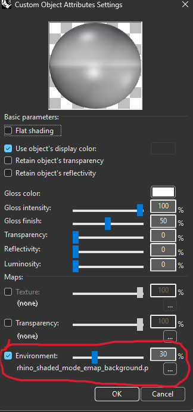
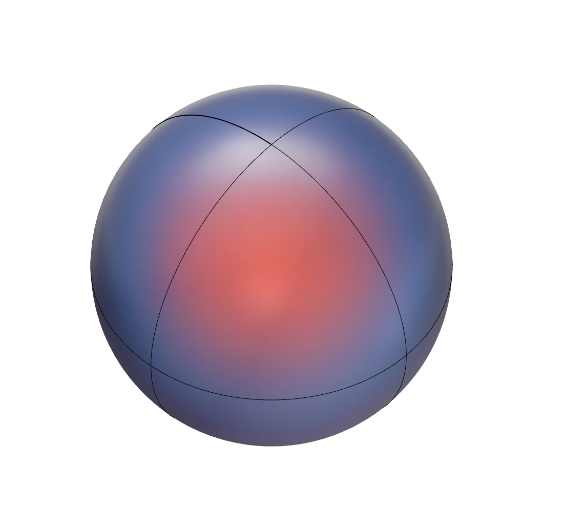
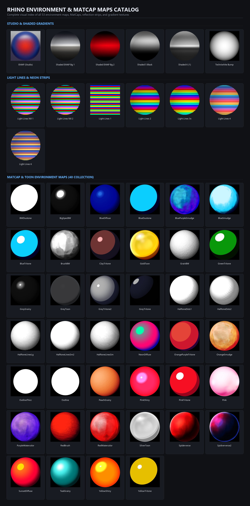

# Rhino Display Modes Collection

A curated collection of custom Rhino viewport display modes and MatCap environment maps gathered from the McNeel Discourse community and custom studio workflows.

## Source
Most of these display modes were sourced and shared by the McNeel Discourse community:
- [Share your custom viewport modes here - McNeel Discourse](https://discourse.mcneel.com/t/share-your-custom-viewport-modes-here/151321/424)

---

## How to Install Display Modes

1. Open **Rhino**.
2. Go to **File** > **Properties** (or type `DocumentProperties` in the command bar).
3. Navigate to **View** > **Display Modes**.
4. Click **Import** and select the `.ini` files from this collection.

---

## Setting Up Environment Maps & MatCaps

Certain display modes (such as MatCaps, shaded glossy modes, studio lighting, or Toon shaders) require an environment map or background map assigned in their shading settings to achieve their intended appearance.

### Step-by-Step Configuration:

1. Open **File** > **Properties** > **View** > **Display Modes**.
2. Select the specific display mode from the list (e.g. *Shaded*, *MatCap*, or custom mode).
3. In the left tree under the mode, select **Shading Settings** or **Custom Game Tools / Rendering Material**.
4. Locate the **Environment** map slot or **Custom Object Attributes Settings**.
5. Enable the **Environment** checkbox, set the desired intensity slider (e.g., `30%` - `100%`), click the browse button (`...`), and select your desired `.tif`, `.png`, or `.jpeg` map from the `MATCAP_TOON` folder or repo root.

| Settings Dialog Configuration | Resulting Shading Preview |
| :---: | :---: |
|  |  |

> [!TIP]
> **Experiment with different maps:** The assigned environment map does not have to match the default. Swap between duotones, watercolors, halftones, neon light lines, or studio reflections from the catalog below to match your project aesthetic.

---

## Environment Maps & MatCaps Catalog

A complete visual index of all **53 environment maps, MatCaps, studio reflection maps, neon strips, and viewport gradients** available in this collection:

---

## Included Display Modes & Categories

- **Bobi Series**: `Bobi`, `Bobi 15`, `Bobi 15 16 Brv`, `Bobi 16`, `BOBI X9`, `Bobi XX14`, `Bobi X23`
- **Technical & Manga**: `Technical`, `Technical Ultra`, `Technical-Dark-Shadows`, `Technical-White-Shadows`, `Technicolor`, `Toon`, `Manga_OG`, `Technical_NK`, `Technical_NK_Invert`
- **Rendered & Glossy**: `Rendered 2`, `Rendered 2X`, `Rendered 3`, `Rendered 4`, `Rendered 5`, `Rendered_NK`
- **Light Lines Series**: `Light lines`, `Light lines 1, 2, 3`, `Light lines 4, 5`, `Light lines 6`, `Light lines NX`
- **Shaded & Contrast**: `Shaded`, `Shaded 5 Black`, `Shaded 6 (1)`, `Techniwhite`, `simple_bright`
- **Stylized & Automotive**: `Badass 2`, `Car paint 2/3/4`, `Crackdown 12`, `Arctic`, `Artistic Styles`, `Slovak`, `konrad`
- **Utility & Diagnostic**: `UV Checker`, `Wireframe`, `Ghosted`, `Miscellaneous`

