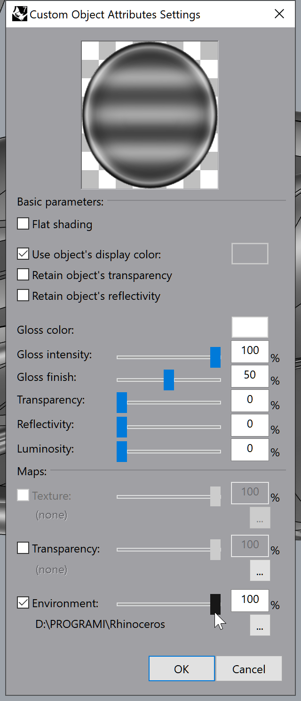

# Rhino Display Modes Collection

A curated collection of custom Rhino viewport display modes gathered from the McNeel Discourse community.

## Source
Most of these display modes were sourced and shared by users in this thread:
[Share your custom viewport modes here - McNeel Discourse](https://discourse.mcneel.com/t/share-your-custom-viewport-modes-here/151321/424)

## How to Install
1. Open Rhino.
2. Go to `Tools` > `Options`.
3. Navigate to `View` > `Display Modes`.
4. Click **Import** and select the `.ini` files from this collection.

## Setting up Environment Maps
Some display modes (like MatCaps or Toon shaders) require an environment map to be manually assigned to look correct. 

To "wire up" an environment map:
1. Select the object in Rhino.
2. Go to the **Properties** panel.
3. Click on **Custom Object Attributes** (or the Material tab depending on your Rhino version).
4. In the **Maps** section, check the **Environment** box.
5. Click the browse button (...) and select one of the `.tif` or `.png` maps (e.g., from the `MATCAP_TOON` folder).

Refer to the image below for the settings configuration:

